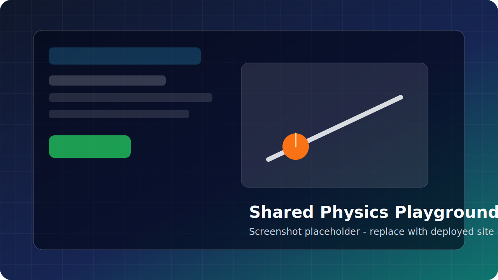

# Shared Physics Playground

> AI-assisted physics lab for interactive, deterministic classroom experiments.

**Languages:** English | [中文](#中文)

## Screenshot



> Replace this placeholder with a real screenshot of the deployed website before publishing widely.

## What It Is

Shared Physics Playground is a focused web lab for asking physics questions and running small interactive experiments. It combines a deterministic built-in experiment catalog with an optional Gemini-backed planner that maps authenticated natural-language prompts to safe, schema-validated simulations.

The product model:

- **Built-in simulations first:** experiments are code-owned and deterministic, not arbitrary model-generated code.
- **AI as a router:** when configured, Gemini interprets the user's prompt and selects/configures one of the supported experiment templates.
- **Interactive learning loop:** sliders, measurements, playback controls, and nearby suggestions help users explore the physics directly.
- **Simple entitlement model:** guests get a fixed demo, Free users get limited AI generation, and Pro interest can be recorded without live payments.

## Current Built-In Experiments

| Experiment | What It Demonstrates |
|---|---|
| Inclined plane | Acceleration, gravity component, friction |
| Projectile motion | Launch angle, range, flight time |
| Spring oscillator | Hooke's law, period, damping |
| Pendulum | Period and gravity |
| Circular motion | Centripetal acceleration |
| Elastic collision | Momentum and energy transfer |
| Buoyancy | Density and floating force |
| Lever balance | Torque and mechanical advantage |
| Ohm's law | Voltage, current, resistance |
| Ideal gas | Pressure, volume, temperature |
| Work and energy | Force, distance, kinetic energy |
| Wave speed | Frequency, wavelength, speed |
| Refraction | Snell's law |
| Lens imaging | Focal length and image distance |
| Coulomb's law | Electric force and charge distance |
| RC circuit | Charging curve and time constant |

## Install

```bash
npm install
cd apps/server && npm install
cd ../web && npm install
cd ../..
cp .env.example .env
cp config/playground-access.example.json config/playground-access.json
```

Requires Node.js 22+ and SQLite support through `better-sqlite3`.

Edit `.env` only for local secrets such as Gemini or SMTP settings. Do not commit `.env`.

## Two-Minute Smoke Test

```bash
./scripts/dev-up.sh
```

Open:

- Web app: `http://127.0.0.1:5173`
- Server health: `http://127.0.0.1:2567/healthz`

Stop local services:

```bash
./scripts/dev-down.sh
```

Run repository checks:

```bash
npm test
cd apps/web && npm run build
cd ../..
npm run check:web-build
./harness/verify.sh
./harness/smoke.sh
```

## Configuration

Common environment variables:

| Variable | Purpose |
|---|---|
| `PORT` | Backend port. Defaults to `2567`. |
| `GOOGLE_API_KEY` | Enables Gemini-backed education planning. |
| `PLAYGROUND_EDUCATION_AI_MODEL` | Optional Gemini model override for education planning. |
| `PLAYGROUND_PRO_INTEREST_EMAIL` | Operator inbox for Pro upgrade-interest emails. |
| `SMTP_HOST`, `SMTP_PORT`, `SMTP_USERNAME`, `SMTP_PASSWORD`, `SMTP_FROM_EMAIL`, `SMTP_FROM_NAME` | Enable real email-code login and Pro-interest delivery. |
| `PLAYGROUND_LOG_LEVEL`, `PLAYGROUND_LOG_PATH`, `PLAYGROUND_LOG_TO_STDOUT` | Structured logging controls. |

Access-tier overrides live in `config/playground-access.json`, copied from `config/playground-access.example.json`.

## Repository Layout

```text
apps/web                  React/Vite frontend
apps/server               Express backend, auth, SMTP, quotas, education planning
packages/prompt-contracts Shared simulation schemas and planner contracts
packages/shared           Shared access-policy helpers
packages/physics-schema   Physics object catalog contracts
tests                     Repository-level smoke and browser tests
scripts                   Local dev and build-analysis helpers
harness                   Lightweight workflow verification
assets                    Public README assets
```

Local planning and deployment notes under `docs/`, `state/`, and `specs/` are intentionally ignored for open-source publishing.

## Open-Source Hygiene

Before pushing to GitHub, scan for accidental secrets:

```bash
rg -n "API_KEY|SECRET|PASSWORD|TOKEN|SMTP|GOOGLE|MINIMAX|sk-|AIza|Bearer" . \
  --glob '!node_modules/**' \
  --glob '!apps/*/node_modules/**' \
  --glob '!apps/web/dist/**' \
  --glob '!docs/**' \
  --glob '!state/**'
```

Expected private files are ignored by `.gitignore`, including `.env*`, `docs/`, `state/`, `data/`, `debug/`, `.dev-runtime/`, SQLite databases, and `config/playground-access.json`.

## License

MIT.

---

# 中文

> 面向物理学习的 AI 辅助互动实验室，用确定性的内置实验来承载自然语言问题。

## 网站截图


> 正式发布前，把这里替换成线上网站的真实截图。

## 这是什么

Shared Physics Playground 是一个聚焦物理小实验的 Web 应用。用户可以输入自然语言问题，系统会把问题匹配到安全、确定、可交互的内置实验模板；如果配置了 Gemini，大模型会负责理解意图和选择模板，但不会生成任意代码。

核心产品思路：

- **内置实验优先：** 实验逻辑由代码控制，结果可预测、可测试。
- **大模型做理解和路由：** 大模型只负责把用户问题映射到支持的实验模板和参数。
- **可交互学习：** 用户可以调参数、看测量结果、播放动画，并在不匹配时选择相近实验。
- **轻量套餐模型：** 游客可看固定演示，Free 用户有有限 AI 生成次数，Pro 购买意向会先通过邮件记录。

## 当前支持的内置实验

| 实验 | 说明 |
|---|---|
| 斜坡实验 | 加速度、重力分量、摩擦 |
| 小球抛射 | 发射角、射程、飞行时间 |
| 弹簧振子 | 胡克定律、周期、阻尼 |
| 单摆 | 周期和重力 |
| 圆周运动 | 向心加速度 |
| 弹性碰撞 | 动量和能量转移 |
| 浮力 | 密度和浮力 |
| 杠杆平衡 | 力矩和机械优势 |
| 欧姆定律 | 电压、电流、电阻 |
| 理想气体 | 压强、体积、温度 |
| 功和能量 | 力、距离、动能 |
| 波速 | 频率、波长、速度 |
| 折射 | 斯涅尔定律 |
| 透镜成像 | 焦距和像距 |
| 库仑定律 | 电荷距离和电场力 |
| RC 电路 | 充电曲线和时间常数 |

## 安装

```bash
npm install
cd apps/server && npm install
cd ../web && npm install
cd ../..
cp .env.example .env
cp config/playground-access.example.json config/playground-access.json
```

建议使用 Node.js 22+。SQLite 由 `better-sqlite3` 提供。

本地密钥、SMTP、Gemini 配置只放在 `.env`，不要提交到仓库。

## 快速烟测

```bash
./scripts/dev-up.sh
```

打开：

- Web 应用：`http://127.0.0.1:5173`
- 服务健康检查：`http://127.0.0.1:2567/healthz`

停止本地服务：

```bash
./scripts/dev-down.sh
```

运行主要校验：

```bash
npm test
cd apps/web && npm run build
cd ../..
npm run check:web-build
./harness/verify.sh
./harness/smoke.sh
```

## 配置

常用环境变量：

| 变量 | 用途 |
|---|---|
| `PORT` | 后端端口，默认 `2567`。 |
| `GOOGLE_API_KEY` | 开启 Gemini 物理实验规划。 |
| `PLAYGROUND_EDUCATION_AI_MODEL` | 可选的 Gemini 模型覆盖。 |
| `PLAYGROUND_PRO_INTEREST_EMAIL` | 接收 Pro 购买意向邮件的运营邮箱。 |
| `SMTP_HOST`, `SMTP_PORT`, `SMTP_USERNAME`, `SMTP_PASSWORD`, `SMTP_FROM_EMAIL`, `SMTP_FROM_NAME` | 开启邮箱验证码登录和 Pro 意向邮件发送。 |
| `PLAYGROUND_LOG_LEVEL`, `PLAYGROUND_LOG_PATH`, `PLAYGROUND_LOG_TO_STDOUT` | 结构化日志配置。 |

用户套餐覆盖配置在 `config/playground-access.json`，从 `config/playground-access.example.json` 复制后本地修改。

## 目录结构

```text
apps/web                  React/Vite 前端
apps/server               Express 后端、登录、SMTP、额度、实验规划
packages/prompt-contracts 共享实验 schema 和规划协议
packages/shared           共享访问策略工具
packages/physics-schema   物理对象 catalog 协议
tests                     仓库级 smoke 和浏览器测试
scripts                   本地开发和构建分析脚本
harness                   轻量工作流校验
assets                    README 公开素材
```

`docs/`、`state/`、`specs/` 里的本地规划和部署记录默认不发布到开源仓库。

## 开源前检查

发布到 GitHub 前，先扫一遍潜在密钥：

```bash
rg -n "API_KEY|SECRET|PASSWORD|TOKEN|SMTP|GOOGLE|MINIMAX|sk-|AIza|Bearer" . \
  --glob '!node_modules/**' \
  --glob '!apps/*/node_modules/**' \
  --glob '!apps/web/dist/**' \
  --glob '!docs/**' \
  --glob '!state/**'
```

`.gitignore` 已忽略 `.env*`、`docs/`、`state/`、`data/`、`debug/`、`.dev-runtime/`、SQLite 数据库和 `config/playground-access.json` 等本地私有文件。

## License

MIT.
